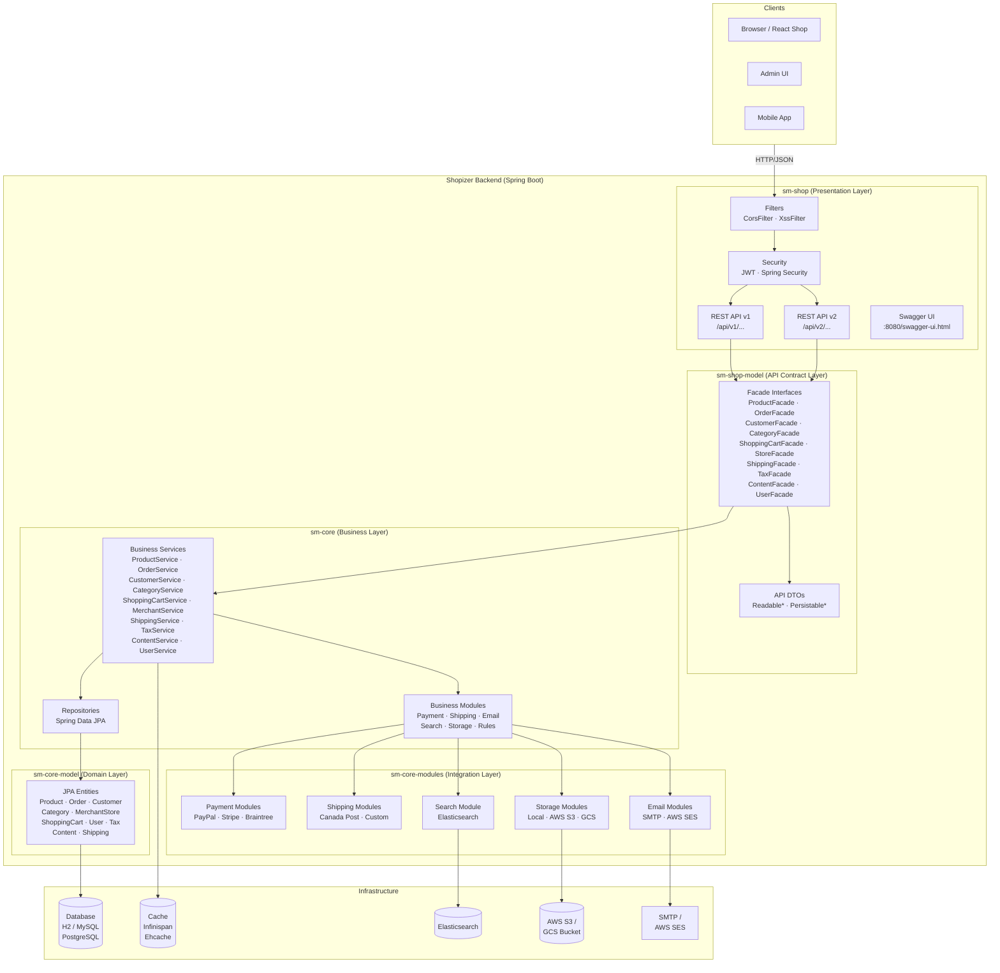
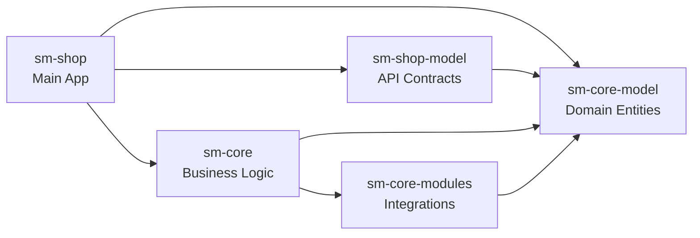
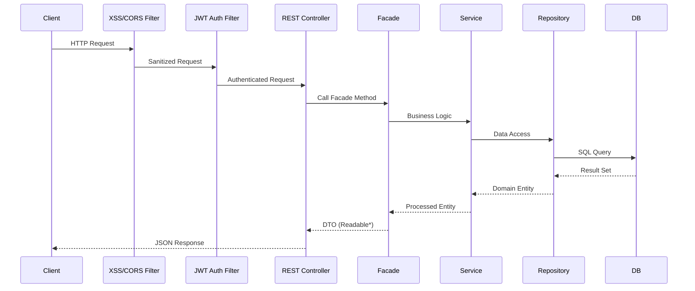
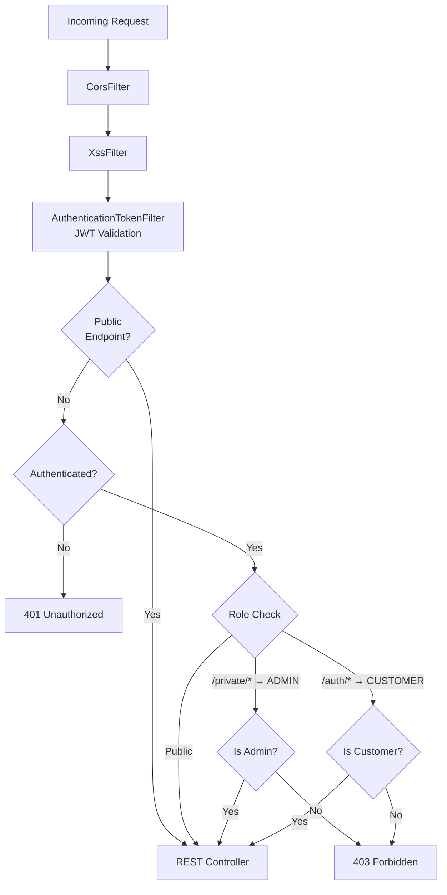
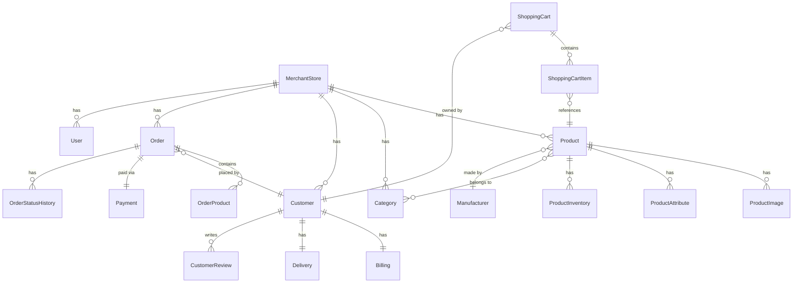
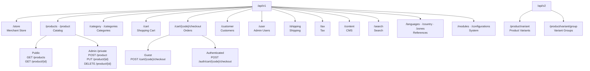
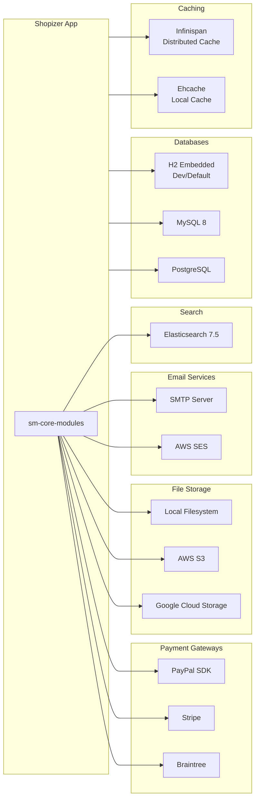

# Shopizer Architecture Diagram

## High-Level System Architecture

---

## Module Dependency Graph

---

## Request Flow

---

## Security Architecture

---

## Domain Model

---

## API Structure

---

## Infrastructure & Integrations

